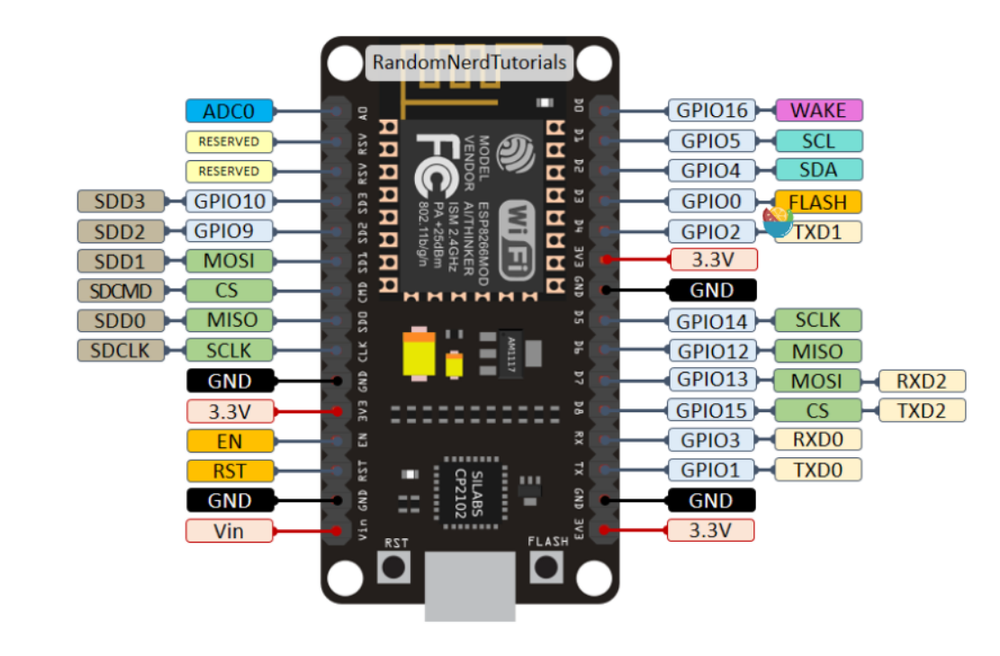
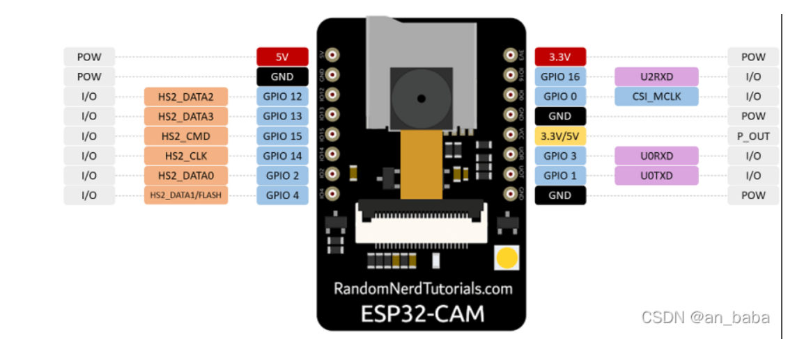
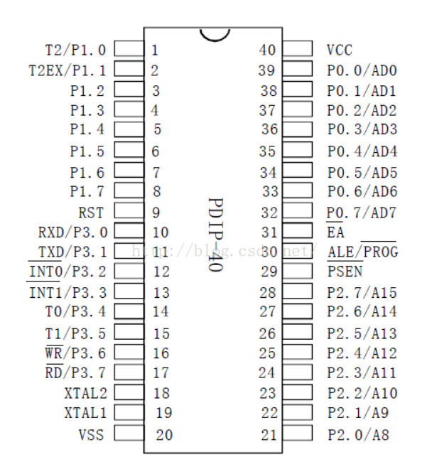

# UGV讲解

[TOC]

## Arduino

该文件夹下为单片机烧录程序，单片机分为两种，一种是*ESP8266* （主小车控制），另一种是*ESP32-cam* （主视频传输） ，文件夹下的单片机程序基本为我们（即2021级学生）的研发过程，具体的使用的文件还需要看[yolov5-swarm/uavdetectweb.py](./yolov5-swarm/uavdetectweb.py) 文件，里面的一些参数会涉及到

其他的代码以后可能会涉及到，主要是利用这两款单片机的web服务，简单传输相关的视频

arduino需要自行导入8266和32的工具包，这里给出链接直接下载：[arduino](https://pan.baidu.com/s/1oJq_CgRntpO72ZvOfH5lIA 提取码：2067  --来自百度网盘超级会员V3的分享)

## 引脚说明

ESP32主视频传输，所以我们供电即可，所以只需要连接POW（可以看成+）和GND（接地，可以看成-），注意是连接c51开发板（包括c51单片机）的POW和GND

ESP8266主控制，所以需要连接C51单片机（这里的单片机可以看成一个导体，只将电源信号传输到相应的电机上），8266部分引脚已被占用，需要将其忽略，具体请自行查找芯片手册，注意pwm调速的引脚也需要自行探索。

### ESP8266单片机的引脚图

### ESP32-cam引脚图

下图为C51引脚图

## yolov5-swarm

该文件夹主要为识别无人机和控制小车的程序，具体的代码功能需要自行探索（主要是21级学生开发过程中忘记写文档了），但项目文件结构较为简单，三天时间足以熟悉

## 后续相关内容由周科任同学进行完善